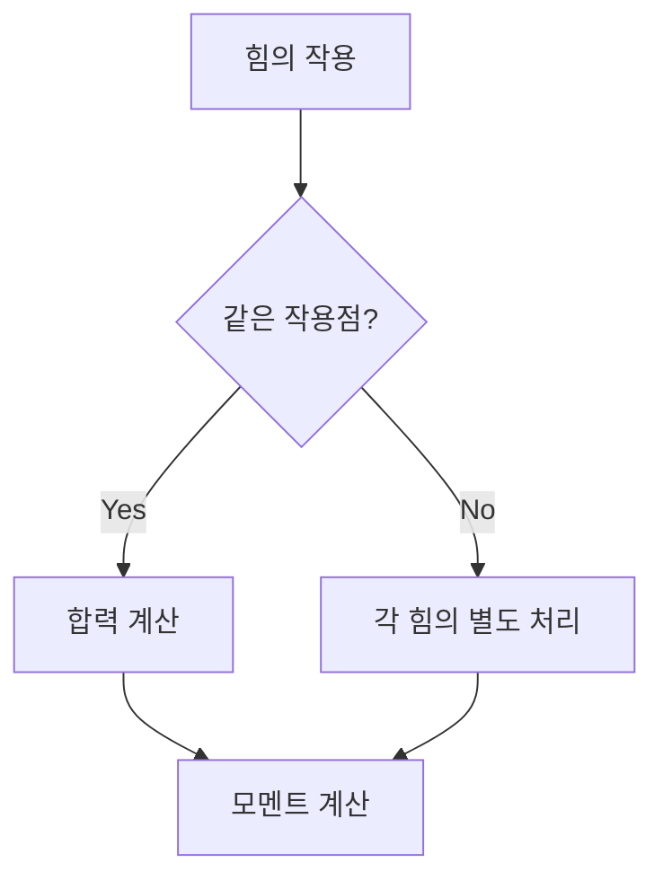

## 📖 개념명
**힘의 합성과 회전**은 물체에 작용하는 힘의 합을 이해하고 회전 운동에 대한 모멘트를 정의하는 학문입니다. 힘은 크기와 방향을 가지며, 이 두 가지 특성을 통해 물체의 운동 상태를 결정합니다.

## 📐 핵심 공식
1. **합력**: 
   $$ R = \sqrt{F_1^2 + F_2^2 + 2F_1F_2 \cos(\alpha)} $$
   - $R$: 합력
   - $F_1, F_2$: 각 힘
   - $\alpha$: 두 힘 사이의 각

2. **모멘트**:
   $$ M = F \cdot d $$
   - $M$: 모멘트
   - $F$: 힘
   - $d$: 힘의 작용선까지의 수직 거리

3. **바리뇽의 정리**:
   $$ M = F_R \cdot d_R = \sum_{i} F_i \cdot d_i $$
   - $F_R$: 합력
   - $d_R$: 합력의 거리
   - $F_i, d_i$: 각 힘과 거리를 나타냄

4. **라미의 정리**:
   $$ \frac{F_1}{\sin(\theta_1)} = \frac{F_2}{\sin(\theta_2)} = \frac{F_3}{\sin(\theta_3)} $$
   - $F_i$: 힘
   - $\theta_i$: 각

## 💡 이해 포인트
- **합력**은 두 힘이 같은 작용점에서 작용할 때 평행사변형 방법을 통해 구할 수 있습니다. 
- **모멘트**는 힘의 작용점으로부터의 수직 거리로 결정되며, 회전 운동을 이해하는 데 필수적입니다.
- **우력**은 서로 반대 방향의 같은 크기를 가진 두 힘이 결합되어 항상 일정한 모멘트를 발생시킵니다.
- **바리뇽의 정리**는 특정 점에 대한 여러 힘의 모멘트 합이 그 점에서의 합력의 모멘트와 같다는 원리입니다.
- **라미의 정리**는 세 힘이 평형 상태에 있을 때 각 힘과 그에 대한 각의 비례관계를 나타냅니다.

## ✏️ 예제 1
주어진 두 힘 $F_1 = 30 \, \mathrm{kN}$, $F_2 = 30 \, \mathrm{kN}$, 그리고 각 $\alpha = 120^\circ$에서의 합력을 구하자.
1. 합력 계산:
   $$ R = \sqrt{30^2 + 30^2 + 2(30)(30) \cos(120^\circ)} $$
   $$ R = \sqrt{900 + 900 - 900} = \sqrt{900} = 30 \, \mathrm{kN} $$

## ✏️ 예제 2
점에서 두 힘 20 kN, 30 kN이 있다고 할 때 이 힘들이 점 B에서 작용할 때의 모멘트를 구하자.
1. 각 힘의 모멘트 계산:
   - $M_1 = 20 \, \mathrm{kN} \cdot d_1$
   - $M_2 = 30 \, \mathrm{kN} \cdot d_2$
   
2. 총 모멘트는 $M = M_1 + M_2$로 표현됩니다.

## ⚠️ 핵심 암기
- **합력**: 같은 작용점에서의 힘은 평행사변형의 원리에 의해 구함.
- **모멘트**: $M = F \cdot d$, 여기서 $d$는 수직 거리.
- **우력의 특징**: 두 힘이 합쳐져도 모멘트는 항상 일정.
- **바리뇽의 정리**: 점에 대한 모멘트 합은 합력의 모멘트와 같다.
- **라미의 정리**: 세 힘의 평형을 설명하며, 각 힘과 각의 비례관계를 수립.

이렇게 재정리한 내용은 힘의 합성과 회전 원리를 이해하는 데 큰 도움이 될 것입니다.