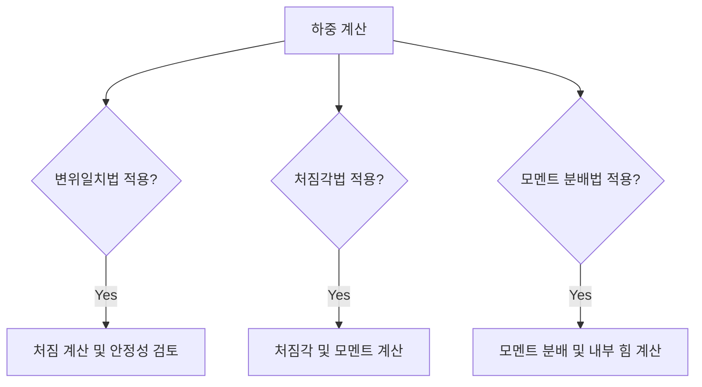

## 📖 부정정구조
부정정구조(Statically Indeterminate Structures)는 평형 조건식만으로 반력과 부재력을 구할 수 없는 구조물로, 변형에 대한 적합 조건식도 추가적으로 고려해야 하는 상태이다. 이 구조물은 힘과 변형의 관계를 동시에 분석해야 하며, 정정 구조물에 비해 설계와 해석이 복잡하다.

## 📐 핵심 공식
1. 변위일치법:
   - $$\sum M = 0$$ (모멘트 평형)
   - $$\delta = \frac{PL^3}{48EI}$$ (단순 보의 중앙 처짐)
   - $$M = EI \frac{d^2y}{dx^2}$$ (굴곡 모멘트와 처짐의 관계)

2. 처짐각법:
   - $$\theta = \frac{M}{EI L}$$ (처짐각)
   - $$\sum M = 0, \quad \sum F = 0$$ (힘의 평형)
  
3. 모멘트 분배법:
   - $$M_{AB} = \frac{M_{A} + M_{B}}{1 + \frac{L}{r}}$$ (모멘트 분배)
   - $$r = \frac{I}{A \cdot \delta}$$ (분배율)

## 💡 이해 포인트
- **변위일치법**은 구조물의 변형을 주의 깊게 다루며, 강체의 하지와 위임의 처짐을 기반으로 한다.
- **처짐각법**은 기본적으로 각도 변화와 모멘트를 이용해 해석하는 방법이다.
- **모멘트 분배법**은 단면의 기하적 성질을 인지하고, 이를 통해 각 부재의 모멘트를 재분배하는 데 중점을 둔다.

## ✏️ 예제 1: 변위일치법 적용
1. 주어진 부재의 하중과 길이를 확인한다.
2. 반력과 처짐을 계산하기 위해 평형 방정식을 설정한다.
3. 적합 조건식을 설정하여 부재의 변위를 구한다.
4. 변위 관계를 바탕으로 추가적인 내력을 계산한다.

## ✏️ 예제 2: 처짐각법 적용
1. 각 정의를 기준으로 평형 방정식을 설정한다.
2. 각 투사와 모멘트를 이용하여 변화를 따라가며 처짐을 계산한다.
3. 결과를 통해 각 공간에서의 반력과 변형량을 확인한다.

## ✏️ 예제 3: 모멘트 분배법 적용
1. 모든 부재에 대해 초기 모멘트를 계산한다.
2. 각 부재의 분배율을 적용하여 모멘트를 재분배한다.
3. 재분배 후 구조물의 최종 모멘트를 확인하고, 이로 인해 발생한 내부 힘을 계산한다.

## ⚠️ 핵심 암기
- 부정정구조는 힘과 변형의 관계를 모두 고려해야 한다.
- 변위일치법은 변형이 동적으로 연결된 구조를 이해하는 데 중요하다.
- 처짐각법과 모멘트 분배법은 고립된 문제를 해결하기 위해 자주 사용된다.
- 각각의 방법은 특정 상황에 적합하며, 구조물 응답의 정확성을 극대화한다.

부정정구조는 변위일치법, 처짐각법, 모멘트분배법을 통해 해석되며, 각 방법은 부정정 구조물에 적절한 응답을 제공하는 데 필수적이다.