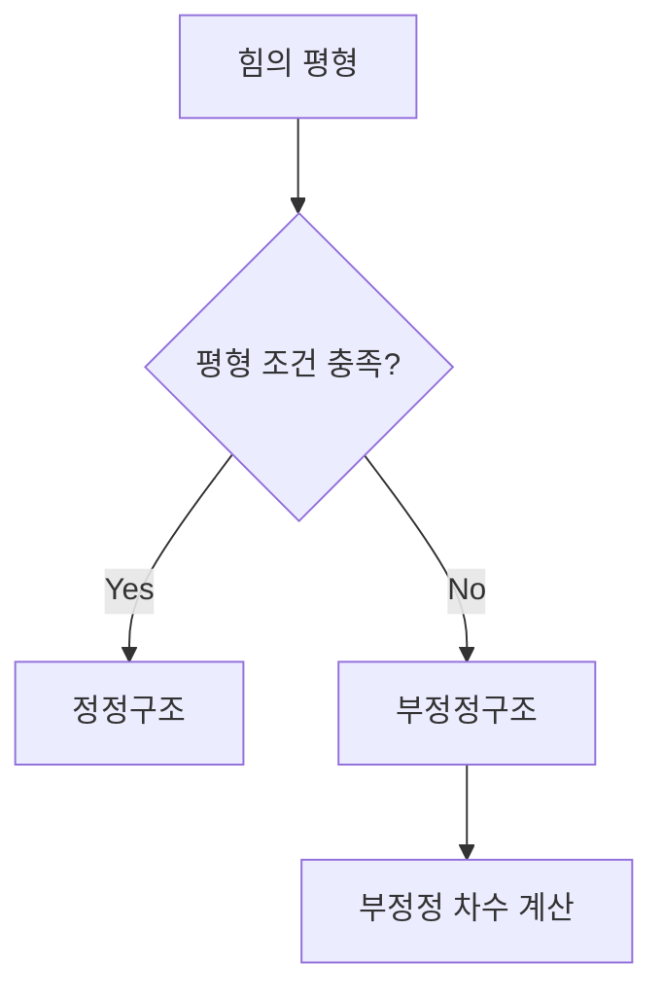

## 📖 개념명
힘의 평형은 구조물에 작용하는 하중이 균형을 이루며 이동하거나 회전하지 않는 상태를 의미합니다. 이를 위해서는 수평, 수직, 모멘트의 평형 조건이 충족되어야 합니다.

## 📐 핵심 공식
구조물의 평형 조건은 다음과 같습니다:
1. 수평 평형: $$\sum F_x = 0$$
2. 수직 평형: $$\sum F_y = 0$$
3. 모멘트 평형: $$\sum M = 0$$
여기서 $F_x$, $F_y$는 각각 수평 및 수직 힘이며, $M$은 모멘트를 의미합니다.

## 💡 이해 포인트
- **정정구조**는 평형 조건만으로 반력과 부재력을 계산할 수 있는 구조이며, **부정정구조**는 추가적인 조건이 필요합니다.
- 구조물의 이동지점, 회전지점 및 고정지점에 따라 저항할 수 있는 힘이 다르므로, 이를 이해하는 것이 중요합니다.

## ✏️ 예제 1
주어진 보의 부정정 차수를 구하는 방법을 다음과 같이 진행합니다:
1. 보의 유형(단순보, 캔틸레버보, 연속보 등)을 확인한다.
2. 해당 보의 반력($r$), 부재 수($m$), 절점 수($j$) 값을 고려하여 공식에 대입한다.
3. 계산식을 적용하여 정정 또는 부정정인지 판단한다.

예시:
- 단순보: $$N = r + m + f - 2j = (2) + (1) - 2(2) = 0$$ (정정)
- 캔틸레버보: $$N = (3) + (1) - 2(2) = 0$$ (정정)

## ⚠️ 핵심 암기
- 평형 조건: $$\sum F_x = 0, \sum F_y = 0, \sum M = 0$$
- 부정정 차수 계산: $$N = r + m + f - 2j$$
- 정정구조: $$N = 0$$, 부정정구조: $$N > 0$$
- 이동지점, 회전지점, 고정지점의 특성을 이해하라.

