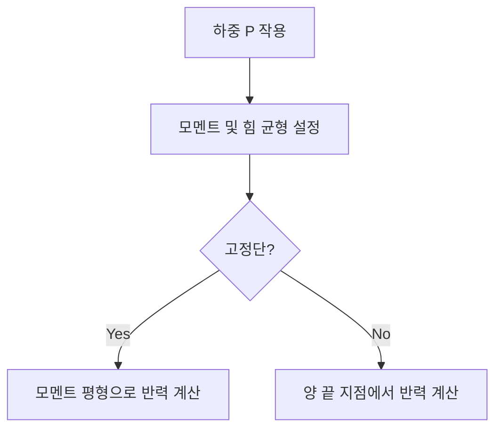

## 📖 개념명
지점반력은 건축 구조물에서 하중이 작용할 때 지지점에서 발생하는 반작용을 의미합니다. 이는 건축물의 안정성과 하중 분포를 이해하는데 중요한 요소로, 여러 가지 형태의 보나 아치 구조에서 반력의 계산 방식이 다릅니다.

## 📐 핵심 공식
### 반력 계산에 필요한 수식

- **단순보(Single Beam)**: 
$$ R = \frac{P \cdot b}{L} $$
- **캔틸레버보(Cantilever Beam)**:
$$ R = P + M \cdot \frac{1}{L} $$
- **겔버보(Gerber Beam)**:
$$ R = \text{각 지점의 하중 / 지점에 따른 거리} $$
- **3-Hinge 아치(3-Hinge Arch)**:
$$ R_{A} + R_{B} + R_{C} = P $$

### 기호 설명
- \( R \): 반력
- \( P \): 작용하는 하중
- \( b \): 두 지점 간 거리
- \( L \): 전체 길이
- \( M \): 모멘트
- \( R_{A}, R_{B}, R_{C} \): 각 지점에서의 반력

## 💡 이해 포인트
- 반력은 하중이 지지점에 전이될 때 생성됩니다. 이를 올바르게 계산하는 것은 구조물의 안전성을 유지하는 데 필수적입니다.
- 단순보에서의 반력은 하중의 위치와 크기에 따라 결정되며, 모멘트 평형을 이용해 계산할 수 있습니다.
- 캔틸레버보와 내민보, 겔버보는 각각 고정 단과 자유 단의 위치에 따라 반력의 계산 방식이 다르기 때문에 주의가 필요합니다.

## ✏️ 예제 1: 단순보 반력 계산
1. 단순보의 길이 \( L = 6\text{m} \), 집중하중 \( P = 10\text{kN} \)가 보의 중간에 작용할 때
2. 반력 \( R \)를 계산하기 위해:
   - 좌측 부재 힘: \( R_{A} = \frac{P}{2} = \frac{10\text{kN}}{2} = 5\text{kN} \)
   - 우측 부재 힘: \( R_{B} = \frac{P}{2} = 5\text{kN} \)

## ⚠️ 핵심 암기
- 단순보의 반력 계산 시 하중의 위치를 고려하여 반력 분배
- 캔틸레버보의 경우 고정단에서 모든 힘과 모멘트 발생
- 겔버보의 경우, 연속 두 개의 지점 반력 계산 시 비례 원리를 적용
- 3-Hinge 아치에서는 수평 및 수직 반력을 독립적으로 고려

### 추가로:
각각의 구조물에 대한 하중 및 반력의 계산은 건물의 안전성과 직결되므로 항상 정확한 계산이 필요합니다.