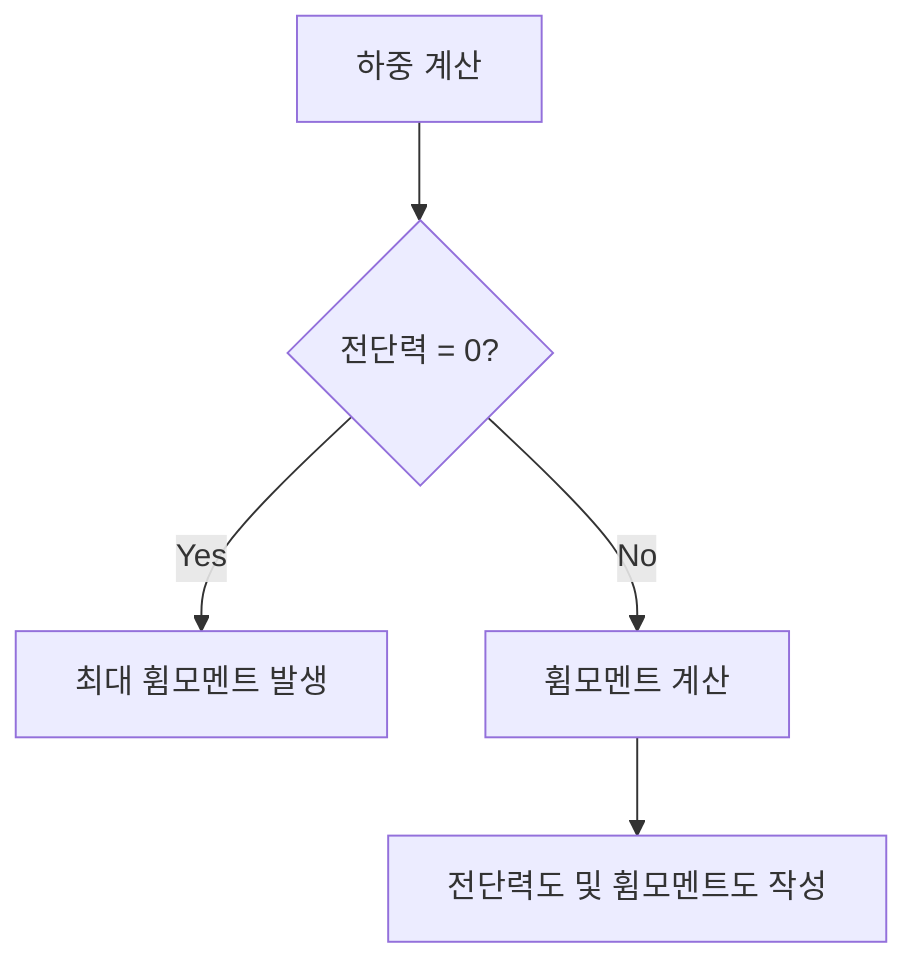

## 📖 전단력·휨모멘트
전단력(K Shear Force)과 휨모멘트(M Bending Moment)는 구조물의 외부 하중이 작용할 때 내부에서 발생하는 힘입니다. 전단력은 특정 단면을 전단하려는 힘이고, 휨모멘트는 그 단면을 구부리려는 힘입니다. 이 두 개념은 구조물의 안정성과 강도를 분석하는 데 기본이 됩니다.

## 📐 핵심 공식
- 전단력: $$ V = \sum F_{y} $$
- 휨모멘트: $$ M = \sum (F \cdot d) $$
  - 여기서 $F$는 수직 하중, $d$는 하중 작용점에서 단면까지의 거리입니다.

## 💡 이해 포인트
- 전단력은 구조물을 수직으로 절단할 때 생기는 힘을 나타내며, 전단력이 0인 지점에서 최대 휨모멘트가 나타난다.
- 휨모멘트는 특정 단면에서 순간적인 회전을 유발하며, 이 값은 이동 하중이 작용할 때 다르게 나타날 수 있다.
- 절대최대휨모멘트는 이동 하중을 고려하여 특정 위치에서 발생하는 최대 휨모멘트 값을 의미한다.

## ✏️ 예제 1: 전단력 계산
1. 단순보를 정의하고 양 끝에서 지점 반력을 계산한다.
2. 특정 지점에서 수직 하중을 작용시키고, 그 절단면의 좌측에서 전단력을 계산한다.
3. 계산한 전단력의 부호(상향력/하향력)를 맞춘다.

## ✏️ 예제 2: 휨모멘트 계산
1. 단순보에서 원하는 점을 선택하고 수직 반력을 계산한다.
2. 좌측 또는 우측 절단된 면에서 하중과 거리의 곱을 이용하여 휨모멘트를 계산한다.
3. 시계방향과 반시계방향에 따라 부호를 설정한다.

## ⚠️ 핵심 암기
- **전단력과 휨모멘트의 정의**: 전단력은 수직으로 작용하는 힘, 휨모멘트는 굽힘 작용하는 힘.
- **부호 규약**: 인장(+), 압축(-), 전단력 K 또는 S, 휨모멘트 M.
- **전단력과 최대 휨모멘트의 관계**: 전단력이 0일 때 최대 휨모멘트 발생.

위 다이어그램은 하중 계산 이후 전단력을 평가하여 최대 휨모멘트를 결정하는 흐름을 나타냅니다. 

이와 같은 개념과 사례를 바탕으로 다양한 구조물의 안정성과 강도를 평가할 수 있는 기초를 형성할 수 있습니다.