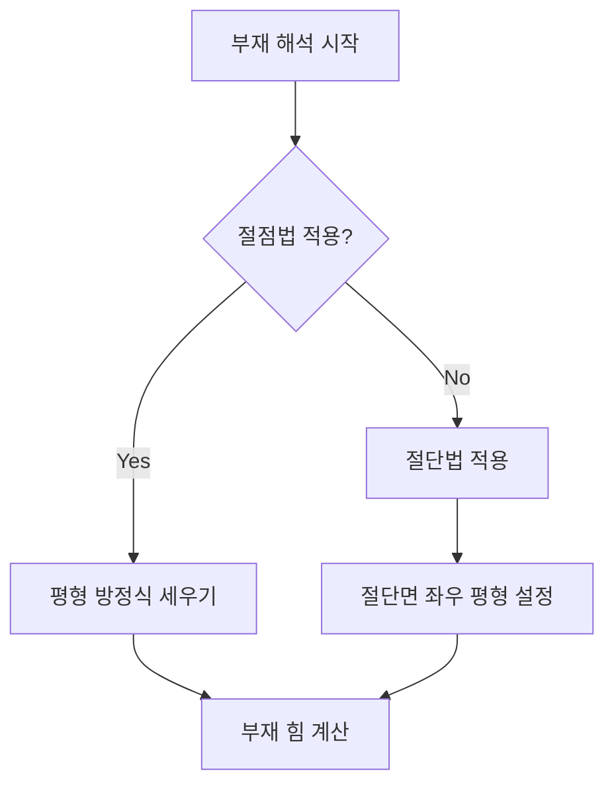

## 📖 트러스 구조해석
트러스 구조해석은 여러 직선 부재가 삼각형 단위로 구성된 구조에서 외력을 효과적으로 전달하기 위한 해석 방법이다. 여기서는 절점법과 절단법을 통해 축방향력을 산정하는 방법을 다룬다.

## 📐 핵심 공식
- 절점법을 통한 평형 방정식:
  
  $$ \Sigma F_x = 0 $$
  $$ \Sigma F_y = 0 $$ 

  - 여기서 $F_x$: 수평 방향으로 작용하는 힘, $F_y$: 수직 방향으로 작용하는 힘

- 절단법에서 사용할 수 있는 전단력 및 모멘트 조건:
  
  $$ \Sigma V = 0 $$
  $$ \Sigma M = 0 $$ 

  - 여기서 $V$: 전단력, $M$: 모멘트

## 💡 이해 포인트
트러스 구조는 축방향력만 작용하며, 평균적으로 각 부재는 직선 형태를 유지한다. 외력은 오직 절점에만 작용하므로 전단력과 휨모멘트는 존재하지 않는다. 이러한 특성 덕분에 트러스 구조는 경량화와 강성을 동시에 달성할 수 있다.

## ✏️ 예제 1
1. 주어진 트러스 구조에서 절점 A의 가상의 하중을 10kN으로 설정한다.
2. 절점 A에서 수평 및 수직 방향의 평형식을 세운다: 
   - $$ \Sigma F_x = 0 $$
   - $$ \Sigma F_y = 0 $$
3. 각 부재의 힘을 인장으로 가정하고 계산을 통하여 결과값이 양수일 경우 인장 부재, 음수일 경우 압축 부재임을 확인한다.

## ✏️ 예제 2
1. 절단법을 적용하기 위해 세 개의 부재를 포함하는 부분에서 구조를 절단한다.
2. 절단된 면에서 전단력 방정식($\Sigma V = 0$)을 설정하여 필요한 부재의 힘을 계산한다.
3. 모멘트 방정식($\Sigma M = 0$)을 이용하여 나머지 부재에 힘을 구한다.

## ⚠️ 핵심 암기
- 트러스는 축방향력만 존재하며, 전단력과 휨모멘트는 없다.
- 절점법은 수평 및 수직 평형 조건으로 해석된다.
- 절단법은 인장 부재가 포함된 최대 3개의 부재로 절단하여 해석한다.
- Zero Force Member는 외력에 의해 힘이 0인 부재로, 특정 조건에서 쉽게 식별할 수 있다.

트러스 구조해석 과정은 시스템의 이해와 해석을 통해 합리적인 구조 설계를 가능하게 한다.