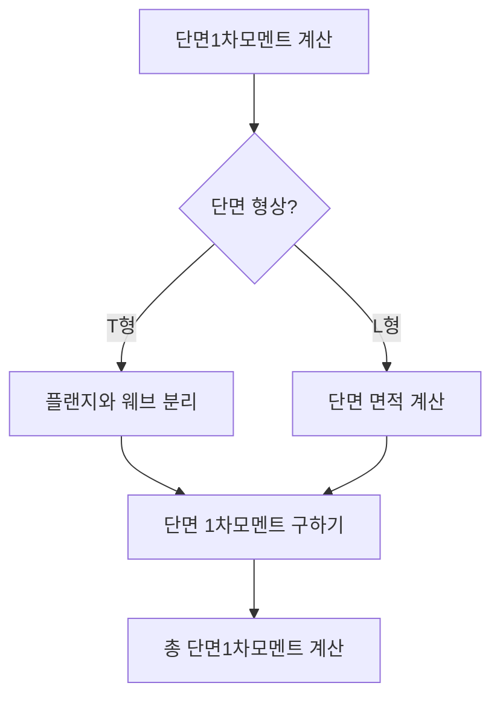

## 📖 개념명
단면의 성질은 건축구조의 안정성을 이해하는 데 필수적인 요소로, 주로 단면의 기하학적 특성을 나타냅니다. 여기에는 단면1차모멘트, 단면2차모멘트, 단면계수, 단면2차반경과 같은 개념이 포함됩니다.

## 📐 핵심 공식
- **단면1차모멘트**:
  $$ Q = \int_A y \cdot dA $$ 
  - $y$: 미소면적 $dA$의 도심까지의 수직 거리
  - $A$: 단면적
 
- **단면2차모멘트**:
  $$ I = \int_A y^2 \cdot dA $$
  - $I$: 단면2차모멘트
  - $y$: 미소면적 $dA$의 도심까지의 수직 거리
  
- **단면계수**:
  $$ Z = \frac{I}{y} $$
  - $Z$: 단면계수
  - $I$: 단면2차모멘트
  - $y$: 압축측 또는 인장측 거리

- **단면2차반경**:
  $$ r = \sqrt{\frac{I}{A}} $$
  - $r$: 단면2차반경
  - $I$: 단면2차모멘트
  - $A$: 단면적

## 💡 이해 포인트
- **단면1차모멘트**는 단면의 도심을 찾는 데 사용되며, 도심을 기준으로 하중 분포를 이해할 수 있습니다.
- **단면2차모멘트**는 구조물이 휨에 저항하는 능력을 나타내며, 단위는 $mm^4$ 또는 $cm^4$로 부호는 항상 양수입니다.
- **단면계수**는 재료의 강도와 관련이 있으며, 휨응력을 평가하는 데 유용합니다.
- **단면2차반경**은 구조물의 안정성을 나타내며, 세장비 계산에 필요합니다.

## ✏️ 예제 1
**단면1차모멘트 계산하기**  
주어진 T형 단면의 면적 $A=4500 \, cm^2$, 도심까지의 거리 $y_1=37.5 \, cm$, $y_2=22.5 \, cm$일 때,  
1. 플랜지의 단면1차모멘트 계산:  
   $$ Q_1 = A_1 \cdot y_1 = A_1 \cdot 37.5 $$ 
2. 웨브의 단면1차모멘트 계산:  
   $$ Q_2 = A_2 \cdot y_2 = A_2 \cdot 22.5 $$ 
3. 총 단면1차모멘트:  
   $$ Q_{total} = Q_1 + Q_2 $$

## ⚠️ 핵심 암기
- 단면1차모멘트: 도심을 구하는 데 필수
- 단면2차모멘트: 휨저항성의 척도
- 단면계수: 휨응력 판단 기초
- 단면2차반경: 좌굴 및 세장비 계산에 필요

이 다이어그램은 단면1차모멘트를 계산하는 흐름을 즉각적으로 시각화하여 이해를 돕습니다. 각 단계에서의 조건과 결과가 명확하게 나타납니다.