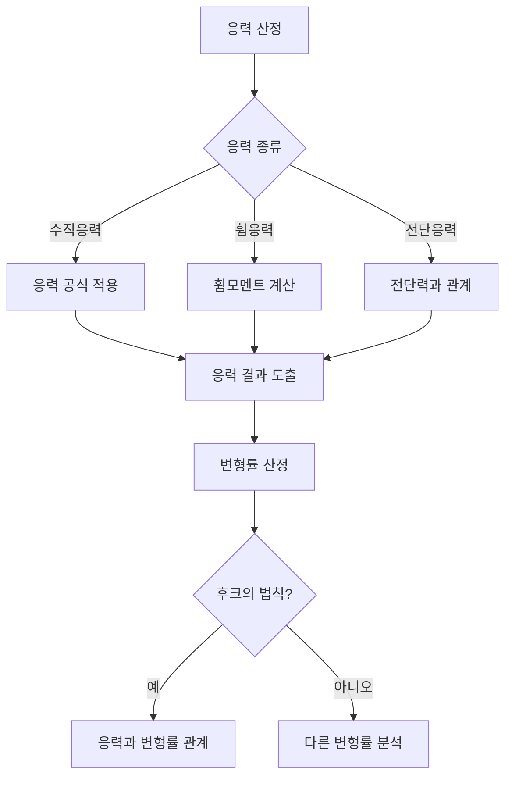

## 📖 개념명
응력(Stress)과 변형률(Strain)은 구조물의 외부 하중이 작용할 때 내부에서 발생하는 힘과 그에 따른 변형의 정도를 나타내는 물리적 성질입니다. 응력은 단위 면적에 작용하는 힘으로 정의되며, 변형률은 구조체의 변형 정도를 나타내는 비율입니다.

## 📐 핵심 공식
- 응력: $$ \sigma = \frac{P}{A} $$
  - $\sigma$: 응력 (N/mm² 또는 MPa)
  - $P$: 작용하는 힘 (N)
  - $A$: 단면적 (mm²)

- 변형률: $$ \epsilon = \frac{\Delta L}{L_0} $$
  - $\epsilon$: 변형률 (비율)
  - $\Delta L$: 길이의 변화 (mm)
  - $L_0$: 원래 길이 (mm)

- 후크의 법칙: $$ \sigma = E \epsilon $$
  - $E$: 탄성계수 (N/mm² 또는 MPa)

- 포아송 비: $$ \nu = -\frac{\epsilon_{lat}}{\epsilon_{long}} $$
  - $\nu$: 포아송비 (비율)
  - $\epsilon_{lat}$: 가로 방향 변형률
  - $\epsilon_{long}$: 세로 방향 변형률

## 💡 이해 포인트
- 응력은 힘이 단면에 분포하는 정도를 나타내며, 이 값이 커질수록 해당 구조물은 부재의 파손 위험이 커집니다.
- 변형률은 재료의 길이나 형상이 얼마나 변형되었는지를 나타내며, 작은 변형이 큰 구조적 문제를 발생시킬 수 있습니다.
- 후크의 법칙은 선형 탄성 범위 내에서만 유효하며, 이 법칙이 적용되는 범위에서 재료는 인장, 압축 및 휨 하중에 대해 선형적으로 반응합니다.
- 포아송비는 재료의 특성에 따라 다르며, 일반적으로 금속 재료는 0.3 내외의 값을 가지고 있습니다. 

## ✏️ 예제 N
1. 어떤 길이 200mm의 강철 막대가 5mm 늘어났다면 변형률을 구하라.
   - 변형률: $$ \epsilon = \frac{5\,\text{mm}}{200\,\text{mm}} = 0.025 $$
  
2. 직경 20mm의 원형 단면에 1,000N의 인장력이 작용할 때 응력을 구하라.
   - 단면적: $$ A = \frac{\pi (20/2)^2}{1000} = 314.16\,\text{mm}^2 $$
   - 응력: $$ \sigma = \frac{1000}{314.16} \approx 3.18\,\text{MPa} $$

3. 후크의 법칙을 이용하여 탄성계수 E가 200GPa인 경우, 변형률이 0.002일 때 응력을 구하라.
   - 응력: $$ \sigma = E \cdot \epsilon = 200000 \cdot 0.002 = 400\,\text{MPa} $$

## ⚠️ 핵심 암기
- 응력의 종류: 수직응력, 휨응력, 전단응력
- 후크의 법칙은 선형 탄성 재료에만 적용됨
- 변형률은 구조물의 안전성을 판단하는 중요 요소
- 포아송비는 재료에 따라 달라지며 영향을 미침 

핵심 개념을 이해하고 수식을 암기하여 다양한 문제를 해결할 준비를 하세요!