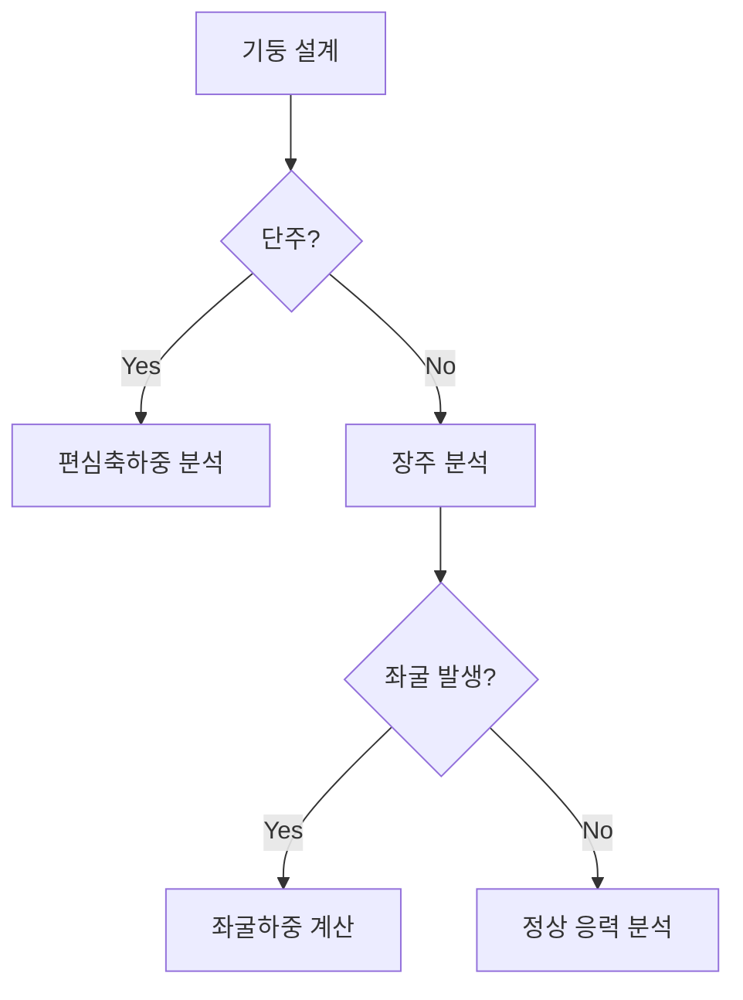

## 📖 개념명
기둥은 축 방향 하중을 지지하는 주요 구조 요소로, 편심축하중에 의해 발생하는 응력과 좌굴 현상에 대한 이해가 중요하다. 단주는 간단하게 편심축하중을 받는 기둥을 의미하며, 장주는 세장한 기둥으로 좌굴과 그에 따른 하중의 영향을 고려해야 한다.

## 📐 핵심 공식
1. 단주에서의 응력:
   $$ \sigma = \frac{P}{A} + \frac{M}{Z} $$
   - $P$: 작용하는 압축력
   - $A$: 단면적
   - $M$: 휨모멘트
   - $Z$: 단면계수

2. 장주에서의 좌굴하중:
   $$ P_{cr} = \frac{\pi^2EI}{(KL)^2} $$
   - $E$: 탄성계수
   - $I$: 단면2차모멘트
   - $KL$: 유효좌굴길이

## 💡 이해 포인트
- 단주에 작용하는 축 방향 하중은 중심에서 벗어나면 편심에 의해 응력 분포에 변화가 생긴다. 이로 인해 휨응력도 발생하게 된다.
- 장주에서는 좌굴이 가장 중요한 문제로, 압축력이 일정 수준을 초과하면 갑작스러운 변형이 발생하여 파괴에 이를 수 있다. 응력 상태와 좌굴의 실제 기계적 행동을 이해하는 것이 중요하다.

## ✏️ 예제 1
**주제: 단주에서의 압축응력 계산**
1. 주어진 데이터: 
   - 압축력 $P = 90 \text{kN}$
   - 단면적 $A = 300 \text{mm}^2$
   - 휨모멘트 $M = 130 \text{N·m}$
   - 단면계수 $Z = 80 \text{mm}^3$
2. 압축응력 계산:
   $$ \sigma = \frac{P}{A} + \frac{M}{Z} 
       = \frac{90 \times 10^3}{300} + \frac{130 \times 10^3}{80} 
       = 300 + 1625 = 1925 \text{N/mm}^2 $$
3. 결과: 기둥의 최대 압축응력은 $1925 \text{N/mm}^2$.

## ✏️ 예제 2
**주제: 장주의 좌굴하중 계산**
1. 주어진 데이터:
   - 탄성계수 $E = 210,000 \text{MPa}$
   - 단면2차모멘트 $I = 1.5 \times 10^6 \text{mm}^4$
   - 유효좌굴길이 $KL = 3 \text{m} = 3000 \text{mm}$
2. 좌굴하중 계산:
   $$ P_{cr} = \frac{\pi^2 \cdot 210,000 \cdot 1.5 \times 10^6}{(3000)^2} 
       = \frac{3.16 \times 10^9}{9 \times 10^6} 
       = 351.11 \text{kN} $$
3. 결과: 장주에서의 좌굴하중은 $351.11 \text{kN}$.

## ⚠️ 핵심 암기
- 기둥의 축방향 하중과 응력 상태를 이해해야 하며, 편심에 따른 응력 변화와 휨을 주의할 것.
- 세장비 계산 및 좌굴 현상을 이해하라.
- 좌굴하중에 대한 형식적 표현과 실질적인 해석이 중요하다.

이와 같은 구조로 기둥에 대한 개념과 응력, 좌굴을 정리하여 체계적으로 공부할 수 있다.