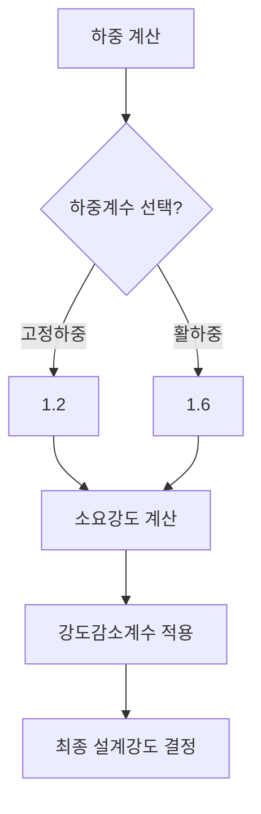

## 📖 개념명
RC 해석과 설계의 원칙은 철근콘크리트 구조 설계의 기본 원칙을 설명합니다. 여기에는 하중계수, 하중조합, 강도감소계수가 포함되며, 극한강도설계법을 통해 소요 강도와 설계 강도를 계산합니다.

## 📐 핵심 공식
극한강도설계법의 기본 관계식은 다음과 같습니다:
$$ U \leq \phi \cdot M_n $$
여기서,
- $U$: 소요강도 (Required Strength)
- $\phi$: 강도감소계수 (Strength Reduction Factor)
- $M_n$: 공칭강도 (Nominal Strength)

## 💡 이해 포인트
- **소요강도 (U)**는 구조물이 작용할 수 있는 최대 하중에 대한 요구 조건을 의미합니다. 
- **설계강도**는 공칭강도에 강도감소계수를 적용한 값으로, 구조물이 실제로 견딜 수 있는 하중을 설명합니다.
- 모든 하중은 변동성을 고려하여 하중계수를 곱해 계산합니다; 이는 극단적인 하중 상황을 고려하여 안전성을 확보합니다.

## ✏️ 예제 1
기본 하중계수를 이용해 소요강도를 구하는 과정:
1. 재료의 기본 하중을 파악한다 (예: 고정하중과 활하중).
2. 하중에 적합한 하중계수를 적용한다 (예: $\gamma_{DL} = 1.2$, $\gamma_{LL} = 1.6$).
3. 소요강도를 계산한다: 
   $$ U = \gamma_{DL} \cdot D + \gamma_{LL} \cdot L $$
4. 각 하중에 대해 하중계수를 곱한 후 결과를 합산한다.

## ⚠️ 핵심 암기
- 하중계수란? 적용되는 하중의 안전성을 고려하여 각 하중에 곱해지는 계수.
- 강도감소계수는 구조물의 재질에 따라 다르며, 일반적으로 폴리머 콘크리트에서는 0.85 등이 사용됨.
- 극한강도설계법은 하중과 강도를 비교하여 구조물의 안전성을 평가하는 데 필수적임.

## 📖 개념명
철근콘크리트 설계에서 하중조합은 다양한 하중 조건을 존재하는 환경을 반영하여 보다 정확한 하중 예측을 위한 조합 방식을 제시합니다. 여러 하중이 동시에 작용하는 경우 이를 종합해 소요강도를 산출합니다.

## 📐 핵심 공식
하중조합에 대한 공식은 다음과 같습니다:
$$ U = \sum \gamma_i \cdot P_i $$
여기서,
- $\gamma_i$: 선택된 하중 계수
- $P_i$: 각 하중의 종류

## 💡 이해 포인트
- 하중조합은 구조물이 다양한 하중 조건에서 안전하게 사용될 수 있도록 설계합니다.
- 예를 들어, 구조물의 기본 하중(고정하중)과 환경 하중(활하중, 바람하중 등)을 각각의 배율로 계산하여 총 하중을 결정합니다.

## ✏️ 예제 2
하중조합을 통해 소요강도를 결정하는 과정:
1. 각 하중의 종류를 식별한다 (고정, 활, 바람, 지진 등).
2. 각 하중에 대해 적절한 하중계수를 적용한다.
3. 모든 하중을 합산하여 최종 소요강도를 도출한다.

## ⚠️ 핵심 암기
- 하중조합은 구조적 안전성을 높이기 위해 각 하중의 영향도를 함께 고려하는 방법.
- 다양한 하중 유형에 따라 서로 다른 하중계수를 사용해야 한다는 점 유의할 것.

이와 같이, RC 해석과 설계의 원칙을 이해하고 다양한 하중 및 강도의 상관관계를 명확히 하는 것이 폭넓은 구조 해석과 설계의 기초가 됩니다.