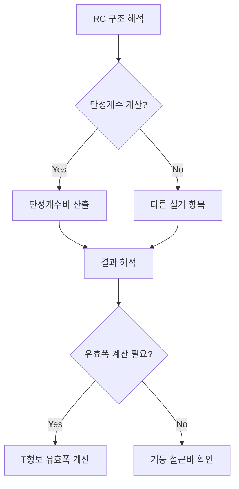

## 📖 개념명
RC 구조 해석의 일반 사항은 철근콘크리트(RC) 구조물의 설계 및 해석 시 필요한 기본 원칙과 계산 방법을 다룹니다. 여기에는 탄성계수, 경량콘크리트 계수, T형보의 유효폭, 기둥의 철근비 등이 포함됩니다.

## 📐 핵심 공식
1. 탄성계수 ($E$) 계산:  
   $$E_c = 8,500 \cdot \sqrt{f_{ck}} \quad (MPa)$$  
   - $f_{ck}$: 콘크리트의 평균 압축 강도

2. 탄성계수비 ($n$):  
   $$n = \frac{E_s}{E_c}$$  
   - $E_s$: 철근의 탄성계수 ($E_s = 200,000 \, MPa$)

3. T형보 유효폭:  
   $$b_{eff} = \text{min}(b_w + \frac{t_s}{2}, \text{span})$$  
   - $b_w$: 보 폭, $t_s$: 슬래브 두께, $\text{span}$: 보 경간

4. 기둥의 최소 철근비 ($\rho_{min}$):  
   $$\rho_{min} = \frac{A_s}{A_g}$$  
   - $A_s$: 주철근의 단면적, $A_g$: 기둥 단면적

## 💡 이해 포인트
- **탄성계수**: 콘크리트의 탄성계수는 구조물의 변형을 예측하는 데 중요한 역할을 합니다. 철근의 항복강도와 비례하며, 이는 하중에 대한 구조물의 저항성을 나타냅니다.
- **경량콘크리트계수**: 경량 콘크리트는 주로 특정 응용에서 하중을 줄이기 위해 사용되며, 설계 시 이 계수를 적용합니다.
- **T형보의 유효폭**: T형보 설계에서 유효폭 계산은 구조의 안정성과 하중 분산에 영향을 미치는 중요한 요소입니다.
- **기둥의 철근비**: 최소 철근비 확보는 기둥의 구조적 안전성을 보장합니다.

## ✏️ 예제 1
**탄성계수비 계산 예제**:  
주어진 사항:  
- 콘크리트 압축강도 ($f_{ck}$) = 24 MPa  
- 철근의 항복강도 = 400 MPa  
- $E_s = 200,000 \, MPa$

1. 평균 압축강도 조정:  
   $$f_{ck} < 40 \Rightarrow 4 = 4 MPa$$
2. 탄성계수 계산:  
   $$E_c = 8,500 \cdot \sqrt{24} = 41,600 \, MPa$$
3. 탄성계수비 계산:  
   $$n = \frac{200,000}{41,600} \approx 4.81$$

## ⚠️ 핵심 암기
- **탄성계수**는 콘크리트 재료에 대한 기초 정보로 사용된다.
- **경량콘크리트계수**에 따라 비례적으로 구조물의 강도가 조정된다는 점을 기억해야 한다.
- **T형보 유효폭**의 정의와 계산 방법을 숙지하자.
- **기둥의 철근비**는 최소 철근비 원칙을 항상 따라야 하고, 일반적으로 1% 이상이어야 한다.

각 단계를 통해 탄성계수, 유효폭, 철근비 등을 조합하여 RC 구조물의 안전성을 평가합니다. 이 흐름을 충실히 따르며 학습하고 암기하는 것이 중요합니다.