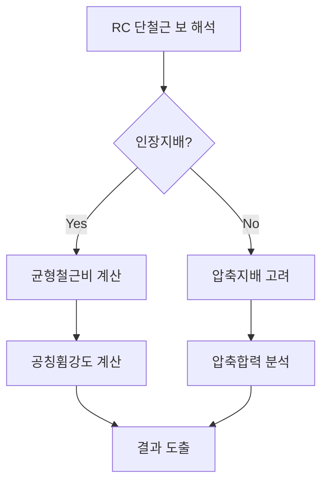

## 📖 개념명
RC 단철근 보 해석은 철근콘크리트 구조물의 휨 성능을 평가하기 위한 과정으로, 단면의 압축 및 인장 응력을 분석하여 휨 강도를 결정하는 방법이다. 주요 요소로는 등가응력블록, 균형철근비, 공칭휨강도가 포함된다.

## 📐 핵심 공식
1. **등가응력블록**의 압축합력:
   $$ C = a (0.85 f_{ck} b d) $$
   - $C$: 압축합력
   - $a$: 압축합력의 크기 계수
   - $f_{ck}$: 콘크리트 압축강도
   - $b$: 단면 너비
   - $d$: 중립축에서 압축합력 작용 위치까지의 거리

2. **균형철근비**:
   $$ \rho_b = \frac{A_s}{b d} $$
   - $\rho_b$: 균형철근비
   - $A_s$: 인장철근의 단면적

3. **공칭휨강도**:
   $$ M_u = C (d - a/3) $$
   - $M_u$: 공칭휨강도 

## 💡 이해 포인트
- **등가응력블록**은 콘크리트 비선형 응력 분포를 단순화하여 충분히 정밀한 분석을 가능하게 한다.
- **균형철근비**는 과도한 철근 사용을 피하는 데 도움을 주며, 인장지배와 압축지배 구분에 기여한다. 인장지배에서는 철근이 더 중요한 역할을 하며, 압축지배에서는 콘크리트가 압축강도에 대한 주요 기여를 한다.
- **공칭휨강도**는 보가 받는 최대 휨 모멘트를 나타내며, 구조물의 안정성을 평가하는 데 필수적이다.

## ✏️ 예제 1
RC 단철근 보의 공칭휨강도를 계산하자. 다음 정보를 사용한다:
- $A_s = 500 mm^2$, $b = 300 mm$, $d = 500 mm$, $f_{ck} = 30 MPa$, $\alpha = 0.85$

1. **압축합력 계산**:
   $$ C = a (0.85 f_{ck} b d) = 0.857 (0.85)(30)(300)(500) $$
2. **균형철근비 계산**:
   $$ \rho_b = \frac{A_s}{b d} = \frac{500}{300 \times 500} $$
3. **공칭휨강도 계산**:
   $$ M_u = C (d - a/3) $$

## ⚠️ 핵심 암기
- **등가응력블록**: 압축응력을 단순화하여 분석하기 위한 방법
- **균형철근비**: 철근의 최적 비율을 계산하는 근거
- **공칭휨강도**: 최대 휨 모멘트를 정의하는 수치
- 인장지배와 압축지배의 이해는 RC 단철근 보의 설계에 필수적이다.

