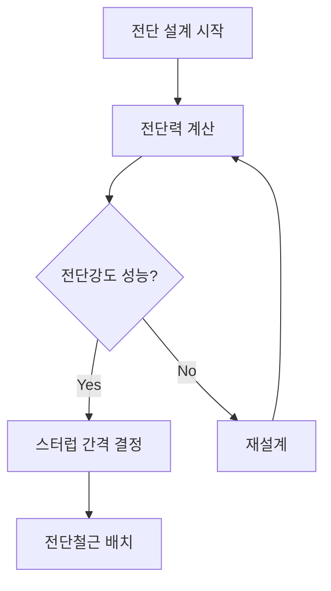

## 📖 개념명
RC 전단설계는 철근콘크리트 구조물의 전단강도를 평가하고, 전단보강철근과 스터럽 간격을 설계하는 과정이다. 이는 구조물의 안전성을 확보하기 위해 필수적이다.

## 📐 핵심 공식
전단강도의 기본 공식은 다음과 같다:
$$
\tau_c = \frac{V_u}{bwd}
$$
- $\tau_c$: 공칭 전단강도 [MPa]
- $V_u$: 적용 전단력 [N]
- $bw$: 보의 폭 [mm]
- $d$: 보의 유효 깊이 [mm]

스터럽에 의한 공칭 전단강도는 다음과 같다:
$$
\tau_s = \frac{A_v f_{yt} d}{s}
$$
- $A_v$: 전단철근의 단면적 [mm²]
- $f_{yt}$: 전단철근의 항복강도 [MPa]
- $s$: 스터럽 간격 [mm]

## 💡 이해 포인트
전단강도는 전단력에 의해 발생하는 응력의 집중도를 의미하며, 응력 집중으로 인해 사인장균열이 발생할 수 있다. 전단철근은 이러한 균열을 방지하기 위해 사용되며, 스터럽은 전단 강화의 핵심 역할을 한다. 최소 전단철근 간격은 균열 방지를 위해 설정된다.

## ✏️ 예제 1
- **문제**: 폭 300mm, 유효 깊이 550mm, 전단철근 단면적 142mm², 항복강도 400MPa인 경우 스터럽이 부담할 전단력을 계산하라.

1. **전단강도 계산**:
   \begin{align*}
   \tau_c &= \frac{V_u}{bwd} = \frac{200 \times 10^3}{300 \times 550} \\
   &= 1.21 \text{ MPa}
   \end{align*}

2. **스터럽 공칭 전단강도 계산**:
   \begin{align*}
   \tau_s &= \frac{A_v f_{yt} d}{s} = \frac{142 \, \text{mm}^2 \times 400 \, \text{MPa} \times 550 \, \text{mm}}{s}
   \end{align*}

3. **스터럽 간격 $s$ 계산**:
   - 적절한 $s$ 값 도출하기 위해, 주어진 전단력을 만족하는 $s$ 값 대입.
   - 스터럽 간격 $s$ 결정: 150mm로 선택.

## ⚠️ 핵심 암기
- 전단강도는 주로 전단력, 스터럽의 간격 및 강도에 의해 결정된다.
- 최소 전단철근 및 스터럽 간격: 부재의 종류와 균열 방지를 위해 중요.
- 사인장균열 방지 위한 스터럽 시공의 중요성.
- 전단철근의 설계기준항복강도는 일반적으로 500MPa를 초과할 수 없다.

이 구성은 RC 전단설계에 대한 전반적인 이해와 설계를 위한 흐름을 제공하며, 주요 목표인 균열 방지와 구조물의 안전성을 확보하는 데 도움이 된다.