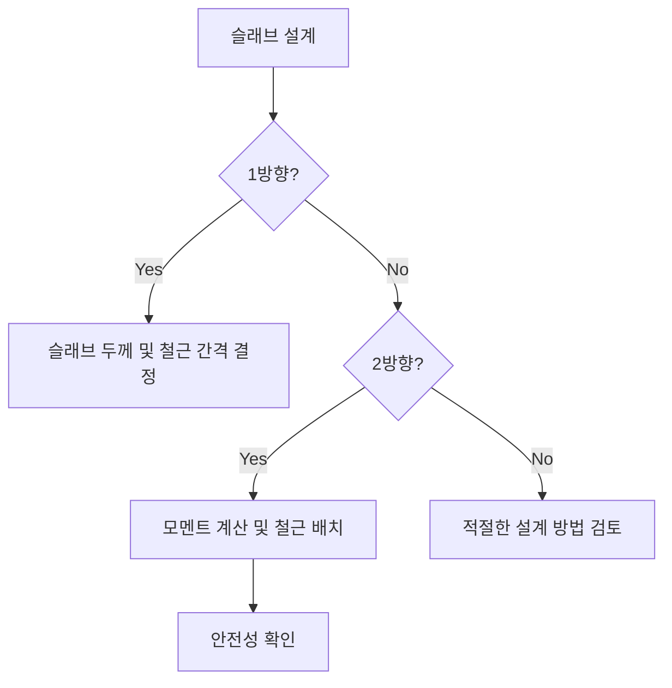

## 📖 RC 슬래브 개념
RC 슬래브(철근콘크리트 슬래브)는 콘크리트와 철근이 결합하여 하중을 지지하는 평면 구조물입니다. 일반적으로 1방향 슬래브와 2방향 슬래브로 구분되며, 각각의 슬래브는 하중을 지지하는 방식과 설계 방법이 다릅니다. 슬래브 두께와 철근 간격은 강도와 안전성에 중요한 요소입니다.

## 📐 핵심 공식
1. 1방향 슬래브 하중 분배 모멘트:
   $$ M_u = 0.8 \cdot b \cdot d^2 $$
   - $M_u$: 설계 모멘트 (kN·m)
   - $b$: 슬래브 폭 (mm)
   - $d$: 슬래브 유효 깊이 (mm)

2. 2방향 슬래브의 모멘트 계수:
   $$ M_{u,1} = 0.65 \cdot \frac{A_u \cdot l_n^2}{L^2} $$
   - $A_u$: 슬래브 면적 (m²)
   - $l_n$: 경간 길이
   - $L$: 슬래브의 단변 길이

3. 최소 슬래브 두께:
   $$ h_{min} = \max \left( 100 \text{ mm}, 0.01 \cdot L \right) $$

## 💡 이해 포인트
- 1방향 슬래브는 짧은 방향으로 주로 하중이 작용하며, 따라서 슬래브 두께와 철근 간격이 중요한 설계 요소입니다. 슬래브 두께는 적어도 100mm 이상이 되어야 하며, 철근 간격은 슬래브 두께의 5배 이하로 제한됩니다. 
- 2방향 슬래브는 2개 방향으로 하중이 작용하여 모멘트가 더 복잡하게 분배됩니다. 경간 차이가 크지 않아야 하고, 경간 수가 3개 이상 이어져야 합니다.

## ✏️ 예제 1: 1방향 슬래브 최대 계수전단력 계산
1. 주어진 데이터: 
   - 피복두께 30mm, 주근 직경 16mm, 슬래브 두께 150mm
   - $f_{ck} = 25$MPa, $ρ = 0.75$, $A = 1m$

2. 슬래브의 최대 계수전단력을 구합니다:
   $$ V_u = 0.7 \cdot b \cdot d $$ 
   여기서 양쪽 슬래브의 폭(b)은 1m로 가정합니다.

3. 계산:
   - $V_u = 0.7 \times 1 \times 75 = 52.5 kN.$
   - 검사: 하중 조건과 비교하여 안전성 검토.

## ⚠️ 핵심 암기
- 1방향 슬래브: 단변 방향 하중, 최소 두께 100mm 이상, 철근 간격은 두께의 5배 이하.
- 2방향 슬래브: 각 방향에 대해 3경간 이상 연속, 경간차는 1/3 이내, 모든 하중은 정적 등분포 하중이어야 하며 활하중은 고정하중의 2배 이하.
- 최소 슬래브 두께는 하중 조건에 따라 달라질 수 있으며, 조기 크랙 및 처짐 방지를 고려해야 함.

