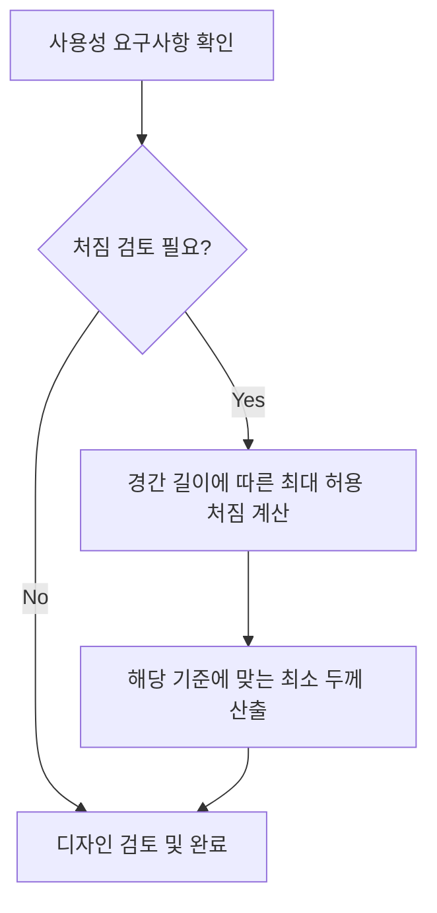

## 📖 개념명
RC구조 사용성이란 구조물이나 구조부재의 일상적인 기능을 유지하기 위한 요구사항으로, 과도한 처짐, 균열 및 진동이 발생하지 않도록 설계하는 것을 의미합니다. 이는 사용자에게 안정감과 쾌적함을 제공하기 위한 필수 요소입니다.

## 📐 핵심 공식
- 최대 처짐 기준:
$$
\Delta_{\text{max}} = \frac{L}{180} \text{ (비구조 요소 미부착 시)}
$$
$$
\Delta_{\text{max}} = \frac{L}{360} \text{ (비구조 요소 부착 시)}
$$  

여기서, 각 기호의 설명은 다음과 같습니다:
- $\Delta_{\text{max}}$: 최대 허용 처짐
- $L$: 경간 길이

## 💡 이해 포인트
사용성이란 구조물이 구조적 안정성을 넘어서 사용자에게 필요한 기능적 요구를 충족하는 것을 말합니다. 장기적 처짐은 시간이 지남에 따라 축적되는 변형을 나타내며, 적절한 설계를 통해 이를 보완해야 합니다. 주의해야 할 점은 최소 두께 규정이 처짐과 균열 예방에 직접적인 영향을 미친다는 것입니다.

## ✏️ 예제 1
1. 주어진 경간 길이($L$)가 6m인 단순 보의 최대 처짐을 계산하는 경우,
   - $\Delta_{\text{max}} = \frac{6000 \, \text{mm}}{180} = 33.33 \, \text{mm}$
   
2. 이 보에 비구조 요소가 부착될 경우,
   - $\Delta_{\text{max}} = \frac{6000 \, \text{mm}}{360} = 16.67 \, \text{mm}$

3. 최종적으로, 비구조 요소가 부착된 경우 처짐 한계를 초과하지 않도록 설계 시, 보의 최소 두께를 고려해야 한다.

## ⚠️ 핵심 암기
- RC구조의 사용성의 핵심 요소는 다음과 같다:
  - 처짐을 통해 비구조 요소의 손상을 방지
  - 균열폭을 제한하기 위한 적절한 철근 배치
  - 내구성을 높이기 위한 충분한 피복두께 설정
- 최대 허용 처짐 기준을 반드시 확인하고 준수해야 한다.
  

### 추가 설명
- 처짐 및 균열을 저감하기 위해 철근 배치 및 피복두께를 획기적으로 고려해야 하며, 이러한 기준은 일반적으로 구조물의 내구성을 결정짓습니다.
- 구조물 설계 시 항상 장기적 관점에서 내구성을 확보해야 하며, 이를 통해 사용성의 기준에 부합하는 구조물을 제공해 줍니다.