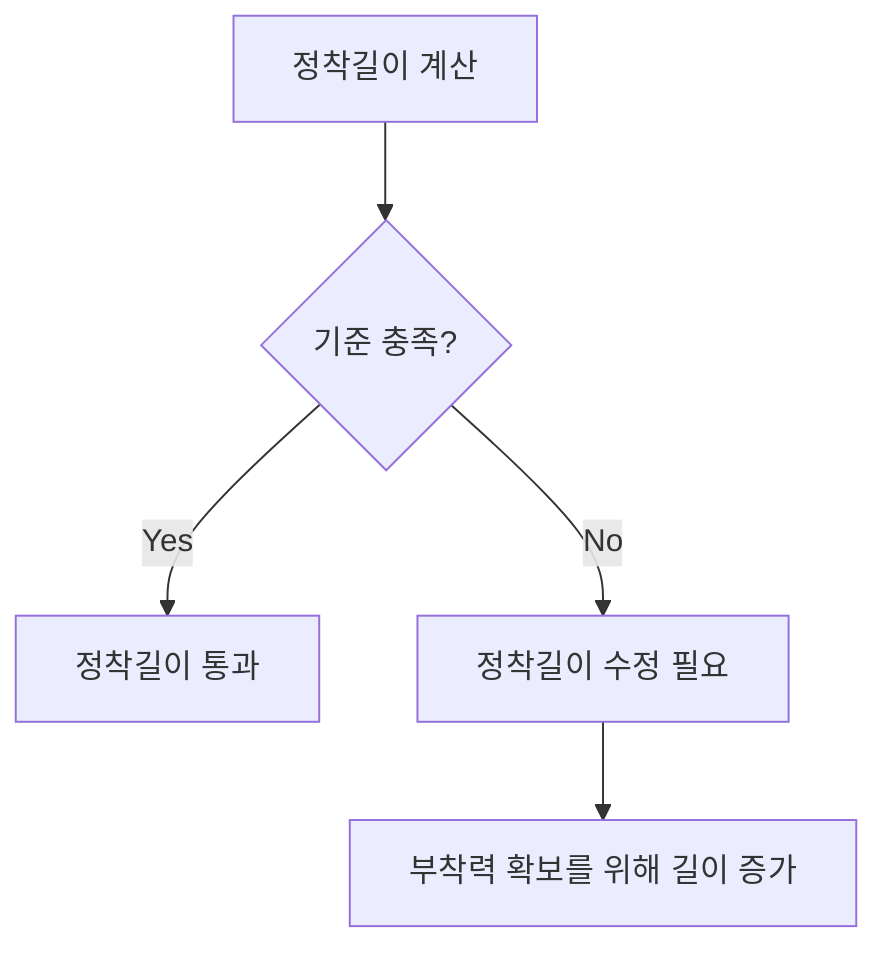

## 📖 개념명
철근콘크리트 구조에서는 철근의 정착길이, 이음길이, 갈고리 설계가 중요하다. 정착길이는 철근이 콘크리트에서 제대로 부착되기 위해 필요한 길이이며, 이음길이는 철근의 두 부분을 연결하기 위한 길이이다. 갈고리는 철근의 끝 부분을 구부려서 부착력을 높이는 방법이다.

## 📐 핵심 공식
1. 정착길이 ($l_d$): 
   $$l_d = \frac{db \cdot f_y}{\tau_b}$$
   - $db$: 철근의 직경 
   - $f_y$: 철근의 항복강도 (MPa)
   - $\tau_b$: 부착강도 (MPa)
   
2. 이음길이 ($l_s$):
   $$l_s = \frac{3 \cdot db \cdot f_y}{\tau_b}$$

3. 갈고리 길이 ($l_h$):
   $$l_h = \frac{db \cdot \omega}{4}$$
   - $\omega$: 갈고리 각도 (예: 90도, 180도)

## 💡 이해 포인트
정착길이가 충분하지 않으면 철근이 콘크리트에서 분리될 수 있어 구조적 안전성이 저하된다. 이음길이는 철근의 연결 강도를 확보하는 데 필수적이며, 갈고리는 부착력을 높여 전체 구조물의 안정성을 향상시키는 역할을 한다. 부착력은 철근과 콘크리트 간의 신뢰성을 결정짓는 중요한 요소이다.

## ✏️ 예제 1
1. 주어진 철근 직경 $db = 20$ mm, 항복강도 $f_y = 400$ MPa, 부착강도 $\tau_b = 1.5$ MPa 일 때 정착길이 $l_d$를 계산하시오.
   $$l_d = \frac{20 \cdot 0.002 \cdot 400}{1.5} = 10.67 \text{ mm}$$
   
2. 동일한 조건에서 이음길이 $l_s$를 계산하시오.
   $$l_s = \frac{3 \cdot 20 \cdot 400}{1.5} = 160 \text{ mm}$$

3. 180도 갈고리의 길이 $l_h$를 구하시오.
   $$l_h = \frac{20 \cdot 180}{4} = 900 \text{ mm}$$

## ⚠️ 핵심 암기
- 정착길이 ($l_d$): 철근이 콘크리트에서 제대로 부착되기 위해 필요한 길이
- 이음길이 ($l_s$): 두 개의 철근을 연결하기 위한 길이
- 갈고리 길이 ($l_h$): 갈고리의 유형에 따라 달라짐
- 피복두께: 철근 보호를 위한 최소 거리 설정
- 철근간격: 공극 없이 콘크리트로 채워지도록 설정되어야 함

