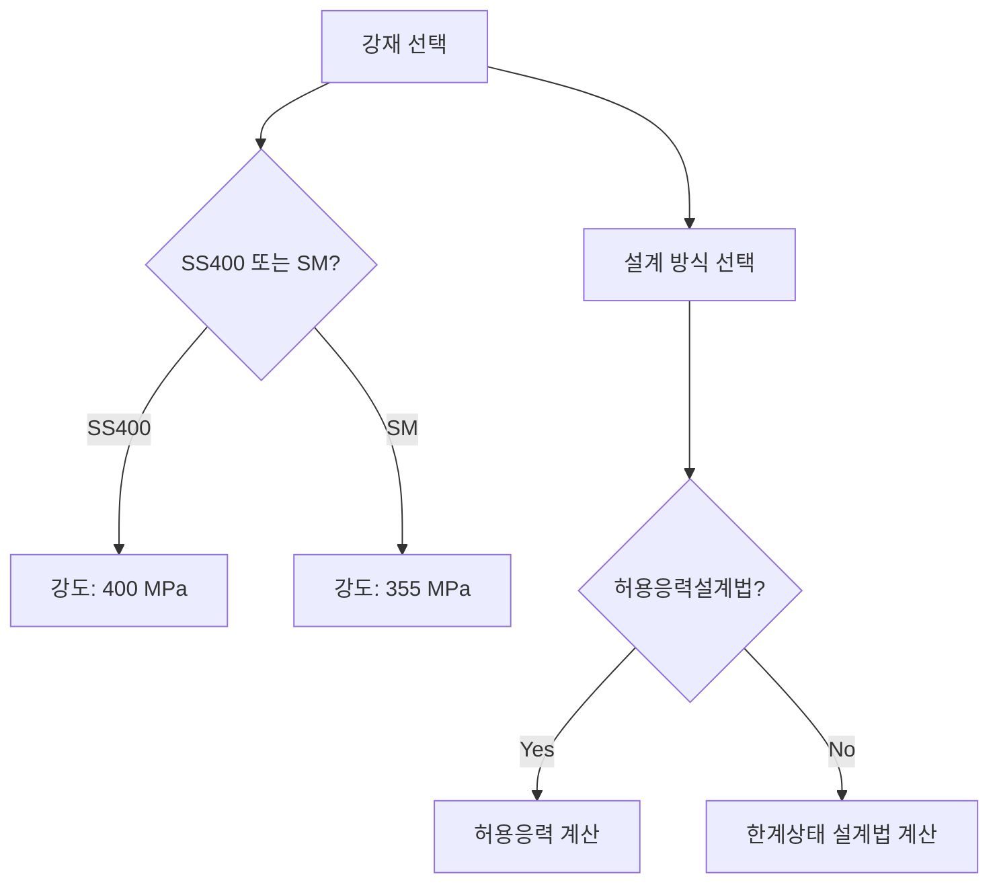

## 📖 개념명
강구조는 고강도 강재를 사용하여 구조물의 강도를 높이고, 경량화 및 효율적인 설계를 도모하는 현대 건축의 기초입니다. 강재의 종류와 설계 방법은 구조물의 안전성과 내구성을 결정짓는 중요한 요소입니다.

## 📐 핵심 공식
강재의 응력-변형률 곡선에서 중요한 점들은 다음과 같습니다:
1. 비례한계점 ($\sigma_{y}$)
2. 항복강도 ($\sigma_{b}$)
3. 극한강도 ($\sigma_{u}$)

- 비례한계점: 하중 증가에 비례하는 응력의 한계
- 항복강도: 재료가 소성변형을 시작하는 응력
- 극한강도: 재료의 최대 인장강도

위의 기호는 다음과 같이 정의됩니다:
- $\sigma_{y}$: 항복강도 (MPa)
- $\sigma_{b}$: 비례한계점 (MPa)
- $\sigma_{u}$: 극한강도 (MPa)

## 💡 이해 포인트
1. 강재의 응력-변형률 곡선에서 비례한계점은 재료의 탄성 영역의 시작을 나타내며, 이 시점까지는 하중이 제거되면 원래 상태로 돌아갑니다.
2. 항복강도 이후에는 재료가 영구 변형을 겪게 되며, 비례한계점과 항복강도 사이의 영역을 세심하게 고려해야 합니다.
3. 바우슁거 효과는 소성 상태의 강재에 압축 하중이 작용할 때 항복점이 낮아지는 현상으로, 이 특성을 주의 깊게 체계적으로 분석해야 합니다.

## ✏️ 예제 1
강재의 항복강도와 극한강도를 비교하기 위한 예제:
1. 강재의 비례한계점은 250 MPa, 항복강도는 400 MPa, 극한강도는 600 MPa입니다.
2. 비례한계점 이후에 발생하는 소성변형이 시작되는 시점을 확인합니다.
3. 강재가 파괴되기 전까지의 강도 저하를 분석합니다.

## ⚠️ 핵심 암기
- 강재의 종류: SS400, SM, SMA, SN 등
- 허용응력설계법과 한계상태설계법 적용에 따른 강도의 변동 이해
- 항복강도와 인장강도 비율이 클수록 연성거동 확보가 어렵다는 점

강구조의 다양한 강재 선택과 설계 방법의 이해는 구조물의 안전과 내구성을 강화하는 데 핵심적입니다.