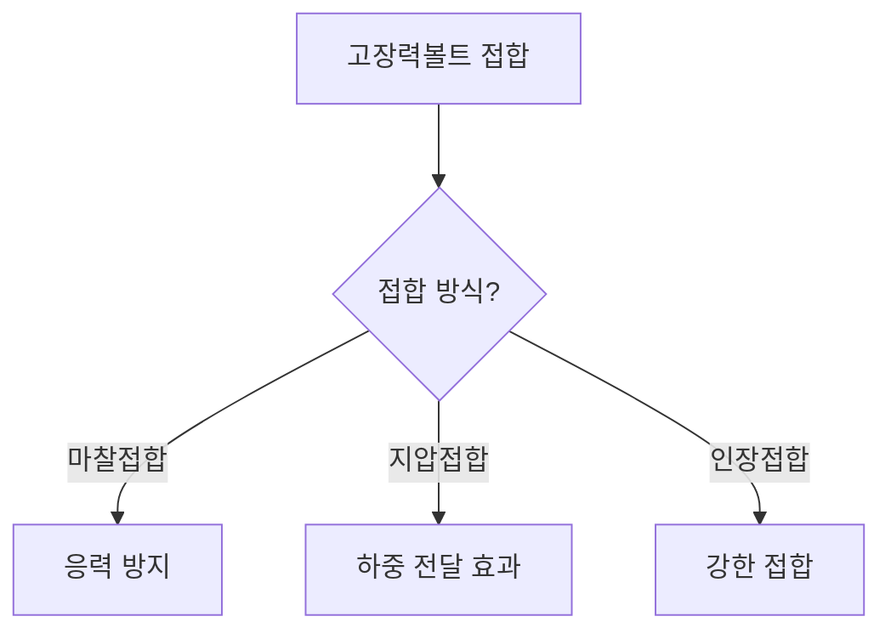

## 📖 개념명
강구조 접합에서 **고장력볼트**는 주로 마찰력에 의존하여 접합 형태를 유지하는 연결 요소이다. 이 볼트는 높은 인장강도를 가지며, 일반적으로 인장 접합, 마찰 접합 및 지압 접합 형태로 사용된다.

## 📐 핵심 공식
1. **설계인장강도**
   $$R_n = 0.75 \cdot f_{nt} \cdot A_b$$
   - $f_{nt}$: 볼트의 공칭 인장강도 (MPa)
   - $A_b$: 볼트의 공칭 단면적 (mm²)

2. **설계전단강도**
   $$R_{n} = 0.75 \cdot f_{nv} \cdot A_b \cdot N_s$$
   - $f_{nv}$: 볼트의 공칭 전단강도 (MPa)
   - $N_s$: 전단면의 수 

3. **설계미끄럼강도**
   $$R_{n} = \mu \cdot R_{t} \cdot h_f \cdot A_b \cdot N_s$$
   - $\mu$: 미끄럼계수
   - $h_f$: 필러계수
   - $R_t$: 설계볼트장력 (kN)

## 💡 이해 포인트
고장력볼트 접합은 마찰접합 방식으로, 이때 마찰력을 통해 접합이 이루어진다. 따라서 접합부가 전단력에 저항하는 강성을 제공하며, 회전저항이 유연해서 휨모멘트를 전달하지 않는다. 주의할 점은 접합부의 최소강도는 45kN 이상이어야 하며, 연결재 및 새그로드는 제외된다.

## ✏️ 예제 1
고장력볼트 F10T-M24의 현장시공을 위한 2차 조임토크 값을 구하시오. (토크계수 = 0.13, 볼트의 축방향 인장력 = 233kN)

1. 첫째, 설계볼트장력 계산:
   $$T = k \cdot N \cdot d = (0.13)(233 \times 10^3)(24) = 726,960 \text{ N·mm}$$
   
2. 둘째, 표준볼트장력 계산:
   $$T_{standard} = 726,960 \times 1.1 = 799,656 \text{ N·mm}$$

3. 따라서, 2차 조임토크 값은 **799,656 N·mm**이다.

## ⚠️ 핵심 암기
- 고장력볼트의 접합 방법: 마찰접합, 지압접합, 인장접합
- 볼트의 설계강도는 **인장강도**와 **전단강도** 두 가지로 구분됨
- 접합부의 최소강도는 **45kN** 이상이며 연결재, 새그로드는 제외됨
- 주의: 작용하는 응력에 따라 적절한 볼트 직경 및 강도를 선택해야 함

이 흐름도는 고장력볼트 접합 방법에 따라 그 특성을 나타낸다. 각 방식별로 응력 방지에 있어 주목해야 할 사항들이 존재한다.