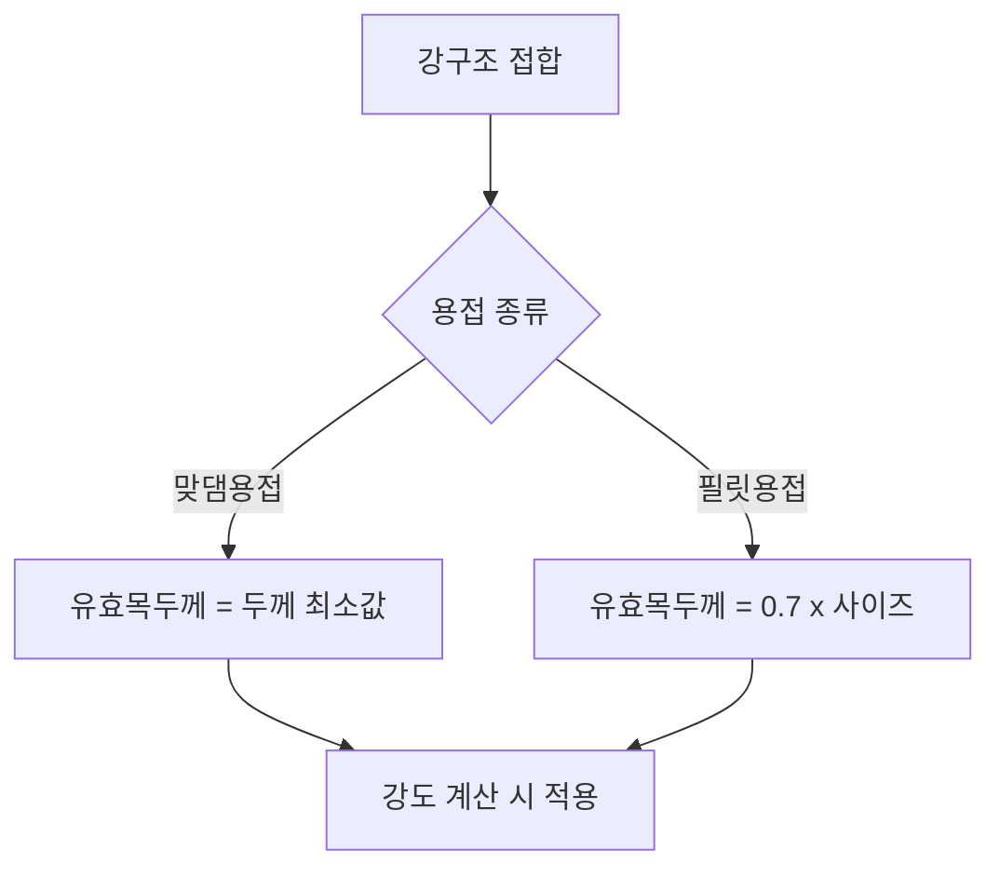

## 📖 개념명
강구조 접합에서 용접은 두 개의 금속 부재를 결합하는 방법으로, 맞댐용접과 필릿용접이 주를 이룬다. 맞댐용접은 두 부재의 매끄러운 표면을 접합하여, 필릿용접은 각 모재의 선단에 이음새를 형성하여 용착하는 방식이다. 유효목두께는 용접이 실제로 강도에 기여하는 두께를 의미한다.

## 📐 핵심 공식
- 맞댐용접 유효목두께: $$ a = \min(t_1, t_2) $$
- 필릿용접 유효목두께: $$ a = 0.7 \cdot h $$
- 유효용접면적: $$ A = a \cdot L_{e} $$ 

여기서, 
- \( t_1, t_2 \): 각각의 모재 두께
- \( h \): 필릿용접의 사이즈
- \( L_{e} \): 유효용접길이

## 💡 이해 포인트
- 맞댐용접은 두 부재의 세밀한 표면 결합을 통해 높은 강도를 나타내는 반면, 필릿용접은 각도를 활용하여 연결의 안정성을 증대시키는 장점이 있다.
- 유효목두께는 특히 구조물 설계에서 용접부의 실제 강도를 결정짓는 요소로 고려된다.
- 필릿용접의 경우, 유효길이가 세부적인 기하학적 구성에 따라 달라질 수 있으므로 정확한 계산이 필요하다.

## ✏️ 예제 1
1. **문제:** 15mm 두께의 모재와 10mm 두께의 모재를 맞댐용접 할 때, 유효목두께는?
   - $$ a = \min(15, 10) = 10 \, mm $$ 
2. **문제:** 필릿용접에서 사이즈가 8mm일 때 유효목두께는?
   - $$ a = 0.7 \cdot 8 = 5.6 \, mm $$ 
3. **문제:** 유효용접면적을 구할 때, 유효목두께가 5mm이고 유효길이가 400mm라면?
   - $$ A = 5 \cdot 400 = 2000 \, mm^2 $$

## ⚠️ 핵심 암기
- 맞댐용접의 유효목두께는 두 모재 중 얇은 쪽의 두께로 결정된다.
- 필릿용접의 유효목두께는 필릿사이즈의 0.7배로 설정된다.
- 유효용접면적은 유효목두께와 유효용접길이의 곱으로 산출된다.
- 필릿용접의 경우 응력을 전달하는 경우에 유효길이와 사이즈는 반드시 주의하여 계산해야 한다.

이와 같이 강구조의 접합 방식에서 유효목두택과 용접의 종류 품질을 이해하고 계산하는 흐름이 필요하다.