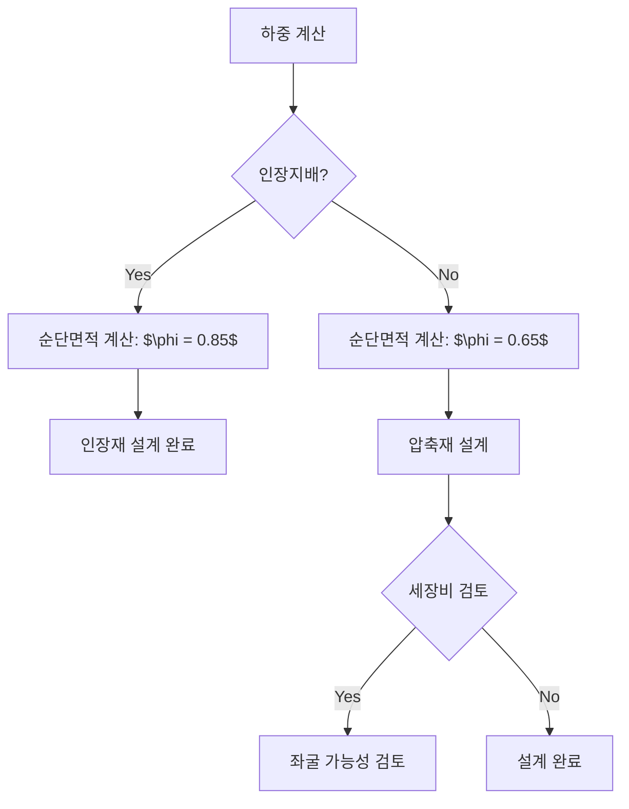

## 📖 개념명
강구조 부재 설계는 철강재로 구성된 구조물에서 인장재, 압축재, 보 및 기타 구조 부재들을 설계하는 과정입니다. 이 과정을 통해 구조물의 안전성과 내구성을 확보할 수 있습니다.

## 📐 핵심 공식
1. 인장재 순단면적: 
   - $$ A_n = A_g - n \cdot d \cdot t $$ (정렬 배치)
   - $$ A_n = A_a - n \cdot d \cdot t + S' \cdot t $$ (엇모 배치)
2. 평균 전단응력: 
   - $$ \tau = \frac{V}{A} $$
3. 판폭두께비: 
   - $$ \frac{b}{t} \leq 4 $$
4. 세장비: 
   - $$ \frac{L_{eff}}{r} $$ (여기서 $L_{eff}$는 유효좌굴길이, $r$은 단면 2차 반경)

## 💡 이해 포인트
- 인장재는 외부 인장력에 저항하며, 순단면적을 통해 강도 계산 시 필수적으로 고려해야 합니다.
- 압축재는 좌굴의 위험이 있으며, 판재의 두께와 폭 간 비율을 조절해 좌굴을 방지합니다.
- 세장비는 부재의 안정성과 관련이 있으며, 값이 높을수록 좌굴이 발생할 위험이 커집니다.
- 최적의 강도와 안정성을 확보하기 위해 설계 시 다양한 재료 및 기하학적 속성을 고려해야 합니다.

## ✏️ 예제 1
### 인장재 순단면적 계산
1. 정렬 배치 인장재에서 $d = 20 \, mm$, $t = 6 \, mm$, 볼트 구멍 수 $n = 2$일 때:
   $$ A_n = A_g - n \cdot d \cdot t = A_g - 2 \cdot 20 \cdot 6 $$
2. 엇모 배치 인장재에서 추가 여유폭 $S' = 2.5 \, mm$일 때:
   $$ A_n = A_a - n \cdot d \cdot t + S' \cdot t = A_a - 2 \cdot 20 \cdot 6 + 2.5 \cdot 6 $$

## ⚠️ 핵심 암기
- **인장재**: 순단면적이 인장재의 최대하중 결정.
- **압축재**: 판폭두께비는 부재의 국부좌굴 방지.
- **세장비**: 값이 클수록 좌굴 위험 증가.
- **유효좌굴길이**: 설계 시 필수 고려 요소.
- **판좌굴**: 웨브의 두께 및 폭 고려해 설계.

이 다이어그램은 인장재와 압축재 설계 과정을 시각적으로 표현하며, 각 단계에서 필요한 검토와 계산 과정을 설명합니다.