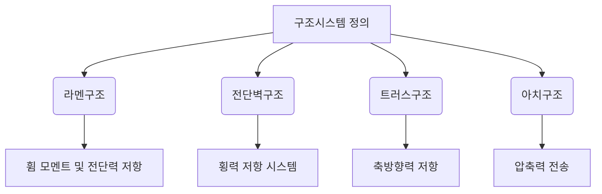

## 📖 구조시스템
구조시스템은 건축물의 하중을 지지하고 분산하는 핵심 구조 방식으로, 각기 다른 특성과用途에 따라 여러 종류가 있다. 대표적인 구조시스템으로는 라멘구조, 전단벽구조, 트러스구조, 아치구조가 있으며, 각각의 구조시스템은 설계 및 시공에 중요한 역할을 한다.

## 📐 핵심 공식
라멘구조에서의 휨 모멘트는 다음과 같이 나타낼 수 있다:
$$M = \frac{wL^2}{8}$$
- $M$: 휨 모멘트
- $w$: 하중
- $L$: 경간 길이

전단벽구조에서의 내력 계산은 다음과 같다:
$$V = \frac{H}{n}$$
- $V$: 전단력
- $H$: 수평 하중
- $n$: 전단벽의 수

## 💡 이해 포인트
- **라멘구조**는 휨 모멘트와 전단력에 저항하며, 강한 경량 구조체로서 주로 저층 및 중층 건물에 사용된다.
- **전단벽구조**는 규칙적인 형상을 가지고 있어 하중을 효과적으로 저항하며, 발생하는 전단력을 직접적으로 분산한다.
- **트러스구조**는 축 방향 힘에 의한 구조로서 경량화가 가능하고 긴 경간을 설계할 수 있다.
- **아치구조**는 압축력으로만 작용하며, 오랜 경량 구조물에 적합하다.

## ✏️ 예제 1: 라멘구조
1. 주어진 하중 $w$와 경간 $L$에 대해 휨 모멘트를 계산한다.
2. 휨 모멘트를 통해 필요한 단면적이나 재료를 결정한다.
3. 최종적으로 구조물의 강도를 검토하여 설계를 완료한다.

## ✏️ 예제 2: 전단벽구조
1. 주어진 수평 하중 $H$를 통해 전단력을 계산한다.
2. 전단벽의 수인 $n$을 고려하여 내력을 설정한다.
3. 모든 벽체에 대한 요구 사항을 검토하면서 배치 계획을 수립한다.

## ⚠️ 핵심 암기
- 라멘구조는 휨 모멘트 및 전단력에 저항.
- 전단벽구조는 일정한 두께를 가진 벽체를 통해 횡력을 저항.
- 트러스구조는 축방향력으로 외력 저항.
- 아치구조는 압축력으로 하중을 전달.

## 📖 각 구조시스템
### 1. 라멘구조
- **정의**: 수직기둥과 수평보로 구성되며, 휨모멘트와 전단력으로 하중을 지지.
- **특징**: 시공이 용이하고 경량화 설계 가능.

### 2. 전단벽구조
- **정의**: 수직벽체가 경량과 수평 하중에 저항.
- **특징**: 높은 내진 성능과 구조적 안정성 제공.

### 3. 트러스구조
- **정의**: 인장력 및 압축력으로 장거리 하중을 받는 구조.
- **특징**: 경량화 가능성과 경제성을 동시에 갖춤.

### 4. 아치구조
- **정의**: 오직 압축력에 의해 하중을 지지하는 곡선 구조.
- **특징**: 긴 경간에 적합하며, 미적 가치가 높음.