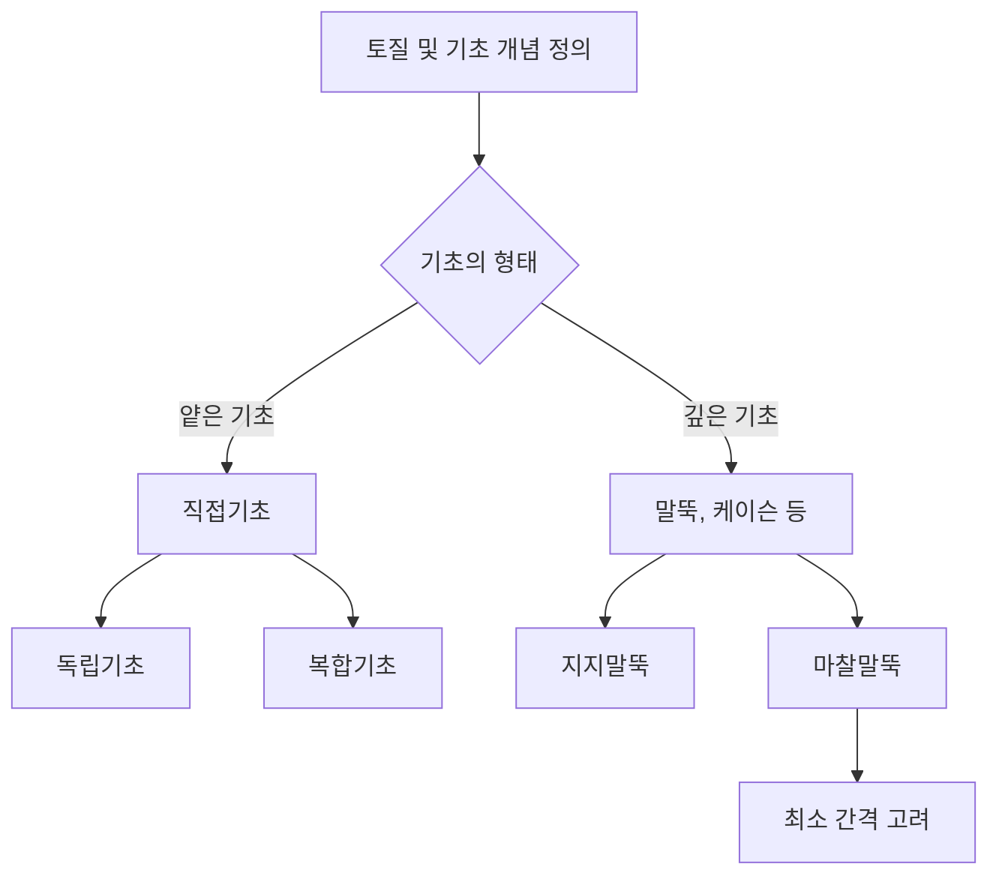

## 📖 개념명
토질 및 기초는 건축 구조물의 안정성을 결정짓는 중요 요소로, 각 지반의 종류와 기초의 설계와 배치 방법을 포함한다. 지반은 다양한 종류가 있으며, 기초는 이를 효과적으로 지지하기 위한 설계가 필요하다. 

## 📐 핵심 공식
- 지지력 계산식:
$$R_{total} = R_{end} + R_{friction}$$
  - $R_{total}$: 총 지지력
  - $R_{end}$: 선단 지지력 (지지말뚝)
  - $R_{friction}$: 마찰에 의한 지지력 (마찰말뚝)

## 💡 이해 포인트
- 기초는 건축물 하중을 지반에 안전하게 전달하기 위한 구조물이다. 
- 얕은 기초와 깊은 기초(bore pile)로 구분되며, 기초 형식에 따라 독립기초, 복합기초로 다시 나뉜다.
- 지반의 특성에 따라 적합한 기초 형식을 선택하고 그에 따라 지지력을 계량해야 한다.

## ✏️ 예제 1
1. 지반 종류를 고려했을 때, 사질토에서 액상화 현상이 발생할 수 있음을 확인하라.
2. 기초 유형으로 온통기초가 부동침하 감소에 효과적이라는 사실을 기억하라.
3. 깊은 기초와 얕은 기초의 차이점(설계 및 하중 전달 방식을 구분하라)을 명확히 이해하라.

## ⚠️ 핵심 암기
- 토질: 사질토, 점토, 자갈, 실트 등 종류를 구분하여 각 특성을 파악
- 기초 종류: 독립기초, 복합기초, 연속기초(줄 기초), 온통기초
- 지지력: 지지말뚝, 마찰말뚝, 말뚝간 최소 간격 등 숙지
- 침하의 유형: 부등침하, 부동침하

