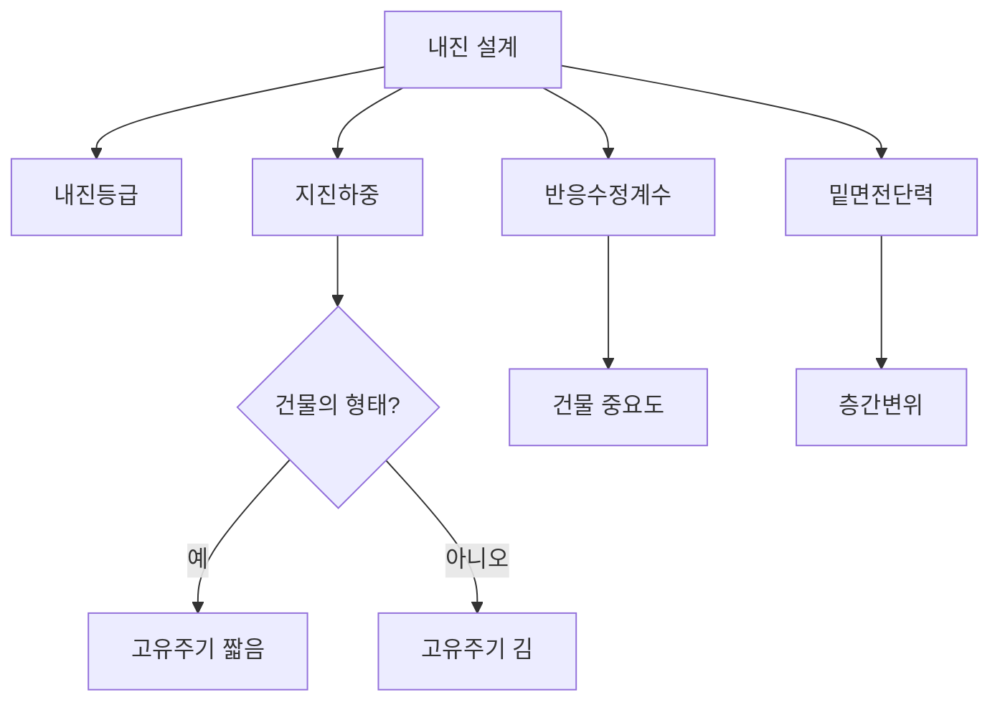

## 📖 개념명
내진 설계는 건축 구조물이 지진 발생 시 구조적 안정성을 유지하고 인명피해를 최소화하기 위해 적용하는 설계기법이다. 기본적으로 지진하중, 내진등급, 반응수정계수, 밑면전단력 등의 요소를 고려하여 설계한다.

## 📐 핵심 공식
- 지진하중 계산식:
$$ V = C_s \cdot W $$
  - $V$: 밑면전단력
  - $C_s$: 지진응답계수
  - $W$: 유효건물중량

- 층간변위:
$$ \Delta = \frac{h_s}{2} \cdot I_e $$
  - $\Delta$: 허용층간변위
  - $h_s$: 층고
  - $I_e$: 내진등급에 따른 중요도계수

## 💡 이해 포인트
- **내진등급**: 건축물의 중요도에 따라 나뉜 등급으로, 등급이 높을수록 더 강한 지진하중을 견디도록 설계된다.
- **지진하중**: 건축물에 작용하는 지진의 힘을 의미하며, 구조물의 크기와 질량에 따라 결정된다.
- **반응수정계수**: 구조물의 저항력을 고려하여 지진하중을 수정하는 계수로, 구조물의 형상과 재료에 따라 달라진다.
- **밑면전단력**: 구조물의 기초에서 발생하는 힘을 나타내며, 고유주기와 유효건물중량에 비례한다.

## ✏️ 예제 1: 지진하중 계산
1. 건물의 유효중량을 500 kN, 지진응답계수를 0.15로 가정하자.
2. 위의 공식을 이용하여 밑면전단력을 계산한다:
   $$ V = C_s \cdot W = 0.15 \cdot 500 = 75 \text{ kN} $$
3. 따라서, 이 건물의 밑면전단력은 **75 kN**이다.

## ⚠️ 핵심 암기
- 내진 설계의 주요 요소는 내진등급, 지진하중, 반응수정계수, 밑면전단력이다.
- 밑면전단력은 유효건물중량과 고유주기에 비례한다.
- 허용층간변위는 내진등급에 따라 다르며, 등급이 높을수록 허용되는 변위도 작아진다.

이와 같이 내진 설계의 핵심 개념과 관계를 도식화하여 각 요소의 상호작용을 강화할 수 있다.